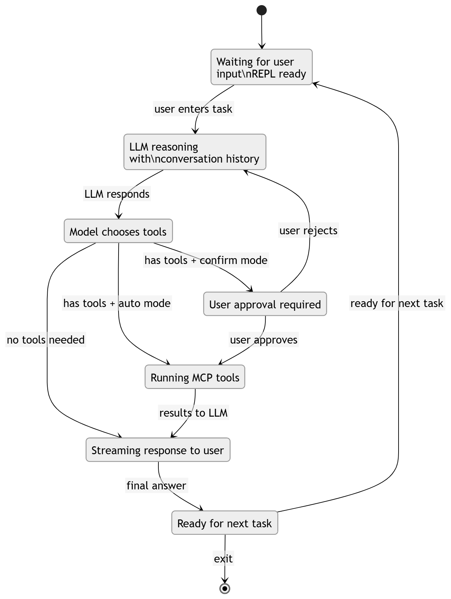
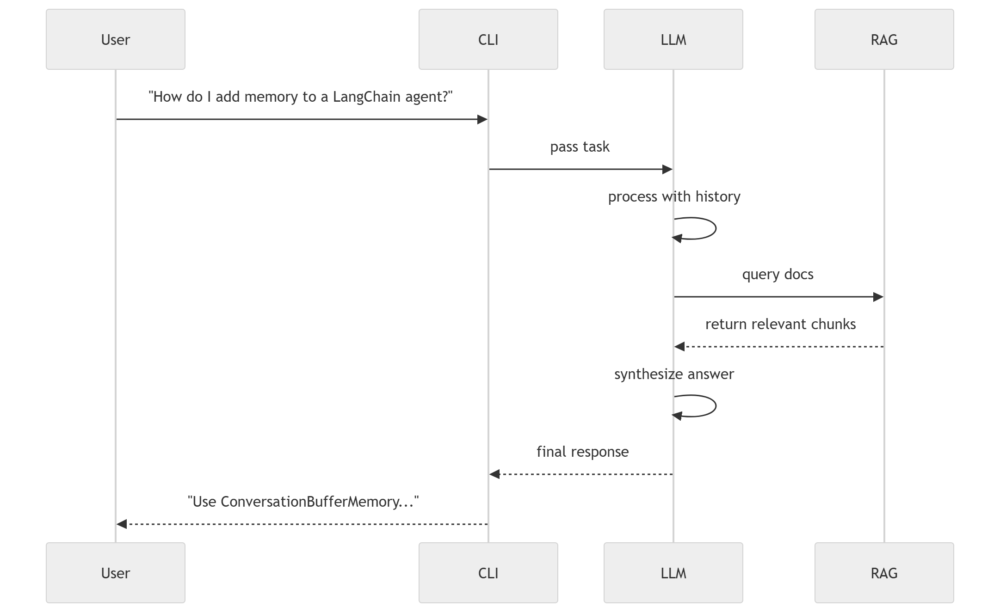
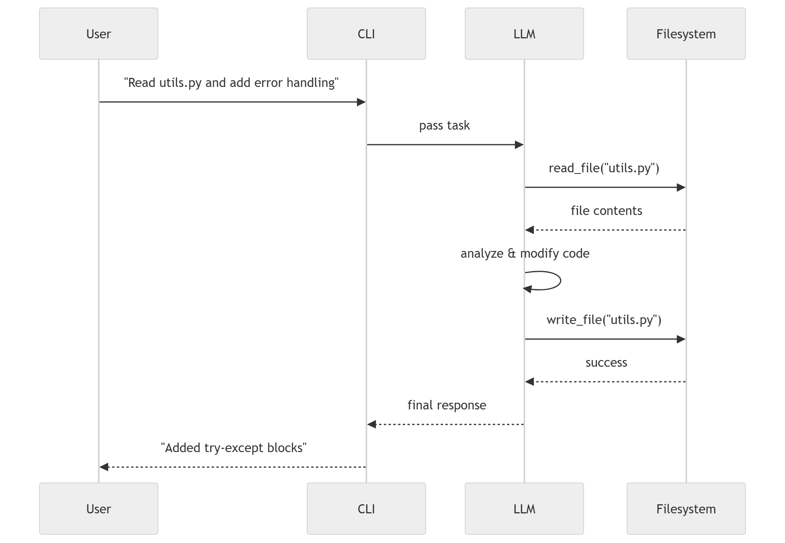

Shailesh Kumar
# 🔩 Needoh — Autonomous CLI Coding Assistant

> *"Give it a task. Walk away."*

Needoh is an autonomous AI coding assistant that lives in your terminal. You describe a task in plain English; Needoh reasons about your codebase, reads and writes files, runs commands, searches the web, queries documentation, and keeps iterating until the job is done.

---

## Course submission helpers

- **[Submission checklist (rubric map)](docs/SUBMISSION_CHECKLIST.md)** — verify requirements vs. this repo  
- **[Demo & test prompts](docs/DEMO_TEST_PROMPTS.md)** — what to ask during QA and video recording  
- **[Diagrams folder](docs/diagrams/README.md)** — where to put state/sequence PNG exports  

## Features

- **Agentic loop** — Needoh acts autonomously until the task is complete
- **Tool calling** — reads/writes files, runs shell commands, searches the web
- **MCP client** — connects to multiple MCP servers and loads tools dynamically
- **Provider abstraction** — swap between Groq (cloud) and Ollama (local) via a flag
- **Confirm / auto mode** — choose whether Needoh asks before executing commands
- **Custom RAG server** — queries LangChain docs via HyDE-enhanced retrieval
- **Streaming-style output** — assistant text prints in word chunks each turn (Groq uses non-streaming API when tools are bound for reliable tool calls)

---

## Architecture
```
Developer → Needoh CLI (REPL)
               ↓
         Agentic Loop
         ┌─────────────────────────────────┐
         │ Task → LLM → Tool calls → Result│
         │         ↑______________________│
         └─────────────────────────────────┘
               ↓                    ↓
      Provider Abstraction     MCP Client
      ┌──────────────┐    ┌──────────────────────────┐
      │ Groq │ Ollama│    │ Filesystem │ Tavily │ C7  │
      └──────────────┘    │       RAG Server          │
                          └──────────────────────────┘
```

---

## Architecture & Design

### System Overview

See our complete planning documentation in [`docs/planning/architecture_v1.md`](docs/planning/architecture_v1.md).

### State Diagram

**Add your exported PNG** to [`docs/diagrams/`](docs/diagrams/README.md) (see that folder for naming).



The state diagram illustrates how Needoh transitions through different operational states:
- **Idle** → waiting for user input
- **Processing Task** → LLM reasoning with conversation history
- **Tool Selection** → model chooses which tools to invoke
- **Awaiting Confirmation** → user approval required (confirm mode only)
- **Tool Execution** → running MCP tools (filesystem, RAG, web search)
- **Displaying Results** → streaming final response
- **Task Complete** → ready for next task

### Sequence Diagrams

#### 1. RAG Documentation Query


Shows how Needoh queries LangChain documentation using our custom RAG server with HyDE (Hypothetical Document Embeddings) for improved retrieval quality.

#### 2. File Read and Edit


Demonstrates the filesystem MCP server in action, including the user confirmation flow in confirm mode.

#### 3. Web Search and Implementation


Illustrates autonomous research using Tavily web search, followed by code generation based on findings.

### Video Demonstration

📹 **[Watch Needoh in Action](docs/video_demo.md)** *(Link will be added after recording)*

See Needoh autonomously complete coding tasks using multiple MCP servers.

---

## Setup

### 1. Clone & install
```bash
git clone https://github.com/Ellyfy/needoh.git
cd needoh
python -m venv .venv
source .venv/bin/activate    # Windows: .venv\Scripts\activate
pip install -r requirements.txt
```

### 2. Install Node.js MCP servers
```bash
npm install -g @modelcontextprotocol/server-filesystem
```

### 3. Configure environment
```bash
cp .env.example .env
# Fill in your API keys
```

### 4. Ingest LangChain docs (one-time setup)
```bash
python rag_server/ingest.py
```

This downloads and embeds the LangChain documentation into a local ChromaDB vector store. Only needs to be run once.

### 5. Run Needoh

Always run from this folder (the one that contains `main.py`). If imports fail, see [docs/DEMO_TEST_PROMPTS.md](docs/DEMO_TEST_PROMPTS.md) (troubleshooting at the top).

```bash
# Default (Groq, confirm mode)
python main.py

# Use Ollama
python main.py --provider ollama --model llama3

# Auto-execute mode (no confirmation prompts)
python main.py --auto
```

---

## Usage
```
⚙  needoh v0.1.0
Type your task, or /help for commands.

> refactor the auth module to use JWT instead of sessions
> write unit tests for utils/parser.py
> find all TODO comments in this codebase and create a GitHub issues list
```

### Slash commands

| Command | Description |
|---|---|
| `/help` | Show available commands |
| `/provider groq\|ollama` | Switch LLM provider |
| `/auto` | Toggle auto-execute mode |
| `/clear` | Clear conversation history |
| `/exit` | Quit Needoh |

---

## MCP Servers

| Server | Purpose |
|---|---|
| `@modelcontextprotocol/server-filesystem` | Read, write, list files on your machine |
| Tavily MCP | Live web search |
| Context7 MCP | Library documentation lookup |
| Custom RAG server | LangChain docs via HyDE retrieval |

---

## Advanced RAG: HyDE

The custom RAG server uses **Hypothetical Document Embeddings (HyDE)**. Instead of embedding the raw user query, Needoh first generates a *hypothetical answer* using the LLM, then embeds that to search the vector DB. This dramatically improves retrieval quality for technical documentation.
```
Query: "how do I add memory to a LangChain agent?"
  ↓ LLM generates hypothetical answer
"To add memory to a LangChain agent, use ConversationBufferMemory..."
  ↓ Embed hypothetical doc
  ↓ Search ChromaDB → return real matching chunks
```

---

## Project Structure
```
needoh/                         # repository root
├── main.py                     # CLI entrypoint & REPL
├── agent/
│   ├── loop.py                 # Agentic loop
│   ├── providers.py            # LLM provider abstraction
│   └── tools.py                # Local shell tools
├── mcpclient/
│   ├── client.py               # MCP client
│   └── config.py               # Server configurations
├── ui/
│   └── display.py              # Rich terminal rendering
├── README.md
├── requirements.txt
├── .env.example
├── docs/
│   ├── planning/
│   │   └── architecture_v1.md
│   ├── diagrams/
│   └── reflection.md
└── rag_server/
    ├── server.py               # MCP RAG server
    ├── ingest.py               # One-time doc ingestion
    ├── retriever.py            # HyDE retrieval logic
    └── chroma_store/           # Persisted vector DB (gitignored)
```

---

## Requirements

- Python 3.11+
- Node.js 18+ (for filesystem MCP server)
- A Groq API key (free tier available at console.groq.com)
- Optional: Ollama installed locally for offline use
